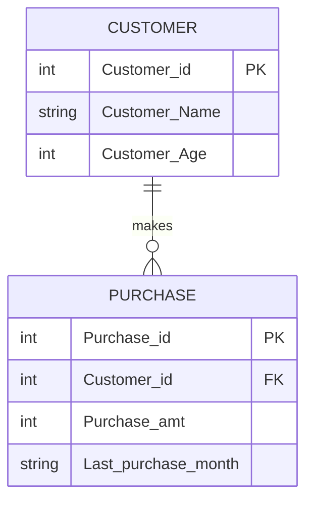

# Project 01: Supermarket Data Analysis

## 1. Business Objective
To analyze customer purchasing behavior and link customer profiles with their transaction history using relational SQL joins.

---

## 2. Entity-Relationship (ER) Model & Design
In this project, we have two main entities: **Customer** and **Purchase**. 
* **Relationship:** One customer can make multiple purchases (**1-to-Many** relationship).

### ER Diagram (Visual Representation)

## 3. Database Schema Structure

* **`Customer Table:`** Stores demographic details of shoppers.
* **`Purchase Table:`** Stores transaction details linked via Customer_id (Foreign Key).

## 4. Tasks & Queries Solved

- Inner join between `Customer` and `Purchase` tables using `Customer_id`.

- Filtering and analyzing purchase amounts and timelines.
